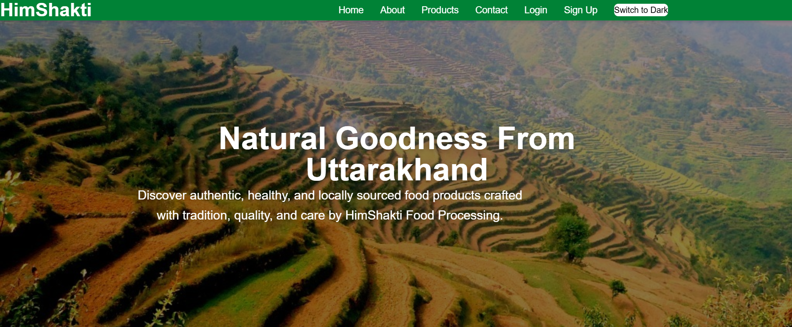
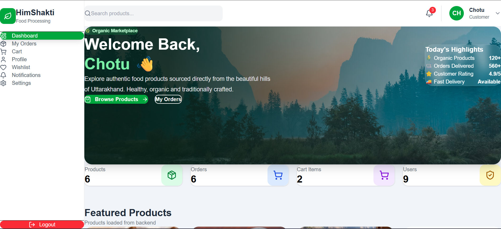
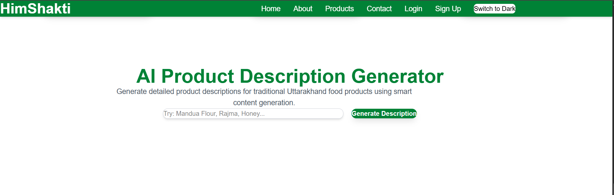
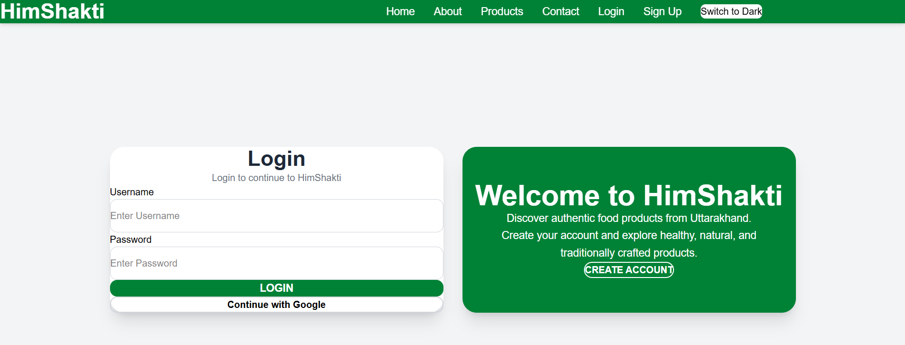

# HimShakti Food Processing

## Project Overview

This project is developed as part of the SIP 2026 Internship Program for HimShakti Food Processing Unit. The goal is to strengthen HimShakti's digital presence by providing a Direct-to-Consumer (D2C) landing page and an AI-powered Product Description Generator for e-commerce platforms.

The solution helps customers discover products, connect directly through WhatsApp, and enables the business to generate professional product descriptions for online marketplaces such as Amazon, Flipkart, and other e-commerce platforms.

---

# Project Screenshots

## Home Page



---

## User Dashboard



---

## AI Product Description Generator



---

## Login Page



---

## Features

- User Signup & Login Authentication
- Google OAuth Login
- Protected Dashboard
- Product Management (CRUD)
- Product Search
- Shopping Cart
- Order Management
- AI Product Description Generator
- PostgreSQL Database Integration
- Responsive User Interface
- Product Details Page
- JWT Authentication

---

## Tech Stack

### Frontend
- React.js
- Vite
- Tailwind CSS
- Axios
- React Router DOM

### Backend
- FastAPI
- SQLAlchemy
- Pydantic
- JWT Authentication
- Google OAuth 2.0
- Google Gemini AI API

### Database
- PostgreSQL (Hosted on Supabase)

---

## Database Choice

This project uses **PostgreSQL** hosted on **Supabase**.

### Why PostgreSQL?

- Reliable relational database
- Supports structured data with relationships
- Easy integration with SQLAlchemy ORM
- Secure cloud-hosted database using Supabase
- Suitable for production-ready applications

---

## Database Schema

The project currently contains two tables:

### Users

| Column | Type |
|---------|------|
| id | Integer |
| username | String |
| password | String |

### Products

| Column | Type |
|---------|------|
| id | Integer |
| name | String |
| price | Float |
| category | String |
| description | String |


---

## Project Structure

```
HimShakti-Food-Processing/
│
├── frontend/
│   ├── src/
│   ├── public/
│   └── package.json
│
├── backend/
│   ├── models/
│   ├── routes/
│   ├── data/
│   ├── database.py
│   ├── main.py
│   └── requirements.txt
│
└── README.md
```

---

## Database Setup

1. Clone the repository.

```bash
git clone https://github.com/Panther-gehu/HimShakti-Food-Processing.git
```

2. Navigate to the backend folder.

```bash
cd backend
```

3. Create a `.env` file.

```env
DATABASE_URL=your_postgresql_connection_string
```

4. Install dependencies.

```bash
pip install -r requirements.txt
```

5. Run the FastAPI server.

```bash
uvicorn main:app --reload
```

6. Run the frontend.

```bash
cd frontend
npm install
npm run dev
```

---

## Environment Variables

Create a `.env` file inside the **backend** folder and add the following variables:

```env
DATABASE_URL=your_postgresql_connection_string
JWT_SECRET=your_jwt_secret
GOOGLE_CLIENT_ID=your_google_client_id
GOOGLE_CLIENT_SECRET=your_google_client_secret
GOOGLE_REDIRECT_URI=your_google_redirect_uri
GEMINI_API_KEY=your_gemini_api_key
```

> **Note:** Never commit your actual `.env` file to GitHub. Store sensitive credentials securely and use environment variables in deployment platforms such as Render or Vercel.

---

## API Endpoints

---

### Cart

- GET `/api/cart`
- POST `/api/cart`
- PUT `/api/cart/{id}`
- DELETE `/api/cart/{id}`
- POST `/api/cart/checkout/{userId}`

### Orders

- GET `/api/orders`
- POST `/api/orders`
- GET `/api/orders/{id}`
- DELETE `/api/orders/{id}`

### AI

- POST `/api/ai/generate-description`

### Google OAuth

- GET `/api/auth/google/login`
- GET `/api/auth/google/callback`

---

## Future Enhancements

- Wishlist
- Payment Gateway Integration
- Product Reviews and Ratings
- Admin Analytics Dashboard
- Product Image Upload
- Email Notifications

---

## Contributors

Developed as part of the SIP 2026 Internship Program for HimShakti Food Processing Unit.

---

# Live Deployment

## Frontend (Vercel)

https://him-shakti-food-processing-sandy.vercel.app

## Backend (Render)

https://himshakti-food-processing.onrender.com

## API Documentation

https://himshakti-food-processing.onrender.com/docs

---

# Deployment

### Frontend

- Vercel

### Backend

- Render

---

# Known Limitations (Free Tier)

- Render free tier automatically spins down after inactivity.
- First backend request may take approximately 30–60 seconds.
- AI description generation depends on Google Gemini API availability.
